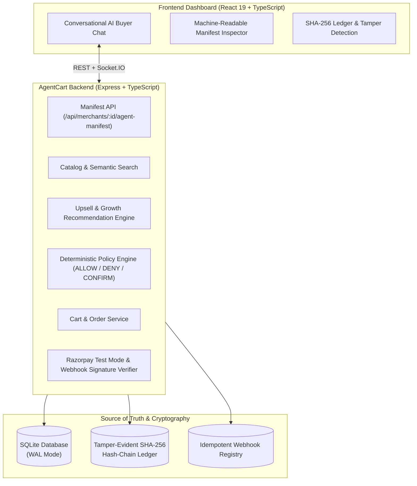

# AgentCart — End-to-End Agentic Commerce Platform

> **TRACK 01 — AI Growth & Agentic Commerce**
> 
> Empower merchants to become discoverable, sellable, and transactable by autonomous AI buyers end-to-end.

AgentCart bridges machine-readable merchant capabilities with state-machine AI buyers, bounded deterministic spending policies, Razorpay Test Mode checkout, idempotent webhooks, and a tamper-evident SHA-256 cryptographic ledger.

---

## 🏗️ Architecture



---

## 🔒 Core Invariant: NEVER Allow the LLM to Control Money

```text
User / Natural Language Prompt
              ↓
   AI Buyer Agent (Intent)
              ↓
  Catalog Discovery & Upsell
              ↓
 Deterministic Policy Engine (ALLOW / DENY / REQUIRE_CONFIRMATION)
              ↓
     Order & Authorization
              ↓
  Razorpay Test Mode Payment
              ↓
  Signature-Verified Webhook (Idempotent)
              ↓
 SHA-256 Cryptographic Ledger
```

---

## 👥 Role-Based Authentication & Pre-Seeded Accounts

AgentCart features real database-backed authentication with password hashing (`bcryptjs`), cryptographic session verification (`JWT`), and tenant isolation:

| Role | Email | Password | Details & Capabilities |
| :--- | :--- | :--- | :--- |
| **BUYER** | `rahul@runner.ai` | `password123` | Autonomous AI shopper, semantic search, dynamic price negotiation, personal spending limits, persisted cart & Razorpay checkout. |
| **MERCHANT** | `merchant@urbanfit.ai` | `password123` | Store manager (`mch_urbanfit_001`), Cloudinary product & inventory publishing, live database revenue analytics, concession limits, machine-readable manifest. |

Users can also register brand-new accounts dynamically with full role assignment and automatic spending policy or merchant store provisioning.

---

## 💳 Razorpay Test Mode Platform Rails Note

For this hackathon buildathon environment:
- Razorpay credentials (`RAZORPAY_KEY_ID`, `RAZORPAY_KEY_SECRET`, `RAZORPAY_WEBHOOK_SECRET`) are configured as **platform infrastructure configuration** in the backend `.env`.
- **Both the BUYER and MERCHANT flows share this single Razorpay Test Mode platform account.** The identities of Buyer and Merchant remain strictly separated at the application and database layer, but payments route through the configured Razorpay Test Mode platform rails.
- Secret keys and webhook secrets exist only on the backend and are **never exposed to frontend clients** or stored in user database records.

---

## 🚀 Quickstart & Running Locally

### 1. Prerequisites
- Node.js 18+
- npm

### 2. Install Dependencies
```bash
npm install
```

### 3. Seed Database
```bash
npm run seed
```
Creates persistent SQLite tables, seeds catalog items & variants, initial spending policies, and both demo accounts (`rahul@runner.ai` and `merchant@urbanfit.ai`).

### 4. Run Backend & Frontend Concurrently
```bash
npm run dev
```
- **Frontend Dashboard:** [http://localhost:5173](http://localhost:5173)
- **Backend API:** [http://localhost:4000](http://localhost:4000)
- **Machine-Readable Manifest:** [http://localhost:4000/api/merchants/mch_urbanfit_001/agent-manifest](http://localhost:4000/api/merchants/mch_urbanfit_001/agent-manifest)

---

## 🧪 Running Tests
```bash
npm test
```
Executes all 18 test suites covering:
- Real role-based authentication, registration, login, and tenant/order isolation
- Deterministic Policy Engine limits, category rules & concurrent race condition prevention
- Razorpay webhook signature verification, replay protection & idempotency
- Cryptographic hash-chain ledger integrity, block validation & tamper localization
- End-to-end conversational agent negotiation and checkout state machine

---

## 🎬 Live Hackathon Demo Walkthrough

1. **Merchant Machine-Readable Manifest**:
   - Go to **"Merchant Catalog & Manifest"** to inspect the JSON manifest exposing catalog search, inventory, cart creation, and checkout endpoints.
2. **Conversational Shopping**:
   - Go to **"AI Buyer & Chat"** and type: `I need running shoes for under ₹5,000`.
   - The agent discovers 3 products, selects **Nike Air Zoom Pegasus 40** (₹4,999), offers an intelligent upsell (**Dri-FIT Socks ₹499**), and checks the spending policy.
3. **Policy Approval & Checkout**:
   - The Policy Engine validates the ₹4,999 cart against the ₹5,000 autonomous limit (`ALLOW`).
   - The agent executes a Razorpay Test Mode checkout and settles the payment onto the ledger.
4. **Cryptographic Tamper-Evidence**:
   - Click **"Verify Ledger"** -> Flashes Green (Valid Chain).
   - Click **"Tamper (Demo)"** to simulate malicious database corruption -> Run **"Verify Ledger"** -> Flashes Red with detected corrupted hash!
5. **Graceful Failure Handling**:
   - Toggle **"Failure Simulation: ON"** in the top bar to demonstrate safe recovery without duplicate charges.

---

## 📚 Complete Documentation
- [Architecture & Design](docs/architecture.md)
- [Agent Flow & State Machine](docs/agent-flow.md)
- [Payment & Razorpay Flow](docs/payment-flow.md)
- [Deterministic Policy Engine](docs/policy-engine.md)
- [Cryptographic Audit Model](docs/audit-model.md)
- [Failure Handling & Recovery](docs/failure-handling.md)
- [Hackathon Demo Script](docs/demo-script.md)
- [Progress Log](docs/progress.md)
