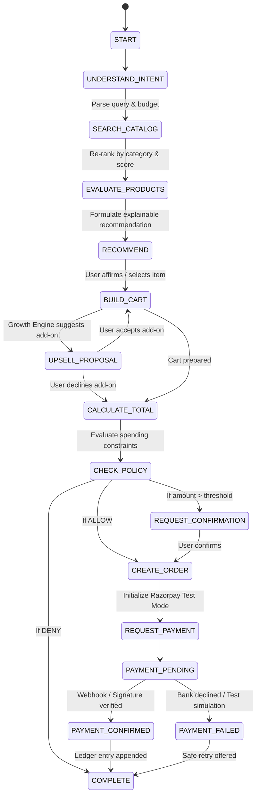

# Agent Workflow & State Machine

The **AgentCart Buyer Agent** orchestrates an autonomous shopping session through an explicit state machine.

## Agent Tools & Guardrails
All tools enforce strict Zod schemas and contain zero direct database mutation or payment execution powers:
- `search_products`: Semantic query over catalog.
- `get_product`: Fetches variants and attributes.
- `check_inventory`: Verifies stock availability.
- `get_product_recommendations`: Retrieves deterministic upsell candidates.
- `create_cart` & `add_to_cart`: Manages cart lifecycle.
- `check_policy`: Invokes deterministic Policy Engine.
- `create_order`: Formalizes order.
- `request_payment`: Interfaces with Razorpay payment service.
