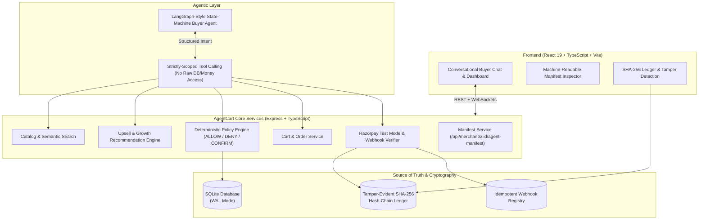

# AgentCart Architecture & Design

AgentCart is an end-to-end **Agentic Commerce Platform** targeting **Track 01 — AI Growth & Agentic Commerce**. It makes online merchants discoverable, sellable, and transactable by autonomous AI buyers while guaranteeing financial safety through deterministic policy enforcement and cryptographic auditability.

## Core Invariant: NEVER Allow LLM to Directly Control Money
1. The LLM or Buyer Agent reasons and produces a structured intent.
2. The Deterministic Policy Layer validates the requested amount, categories, and cumulative daily budget.
3. If allowed, an Order is created and a Razorpay transaction is initialized.
4. Razorpay Webhooks verify signatures cryptographically and process events idempotently.
5. All completed settlements are appended to a SHA-256 hash-chain ledger.

## Monorepo Layout
- `backend/`: Express, TypeScript, better-sqlite3, Razorpay SDK, Socket.IO.
- `frontend/`: React 19, TypeScript, Vite, Lucide Icons, Glassmorphism CSS.
- `docs/`: Complete technical architecture and demo flow documentation.
