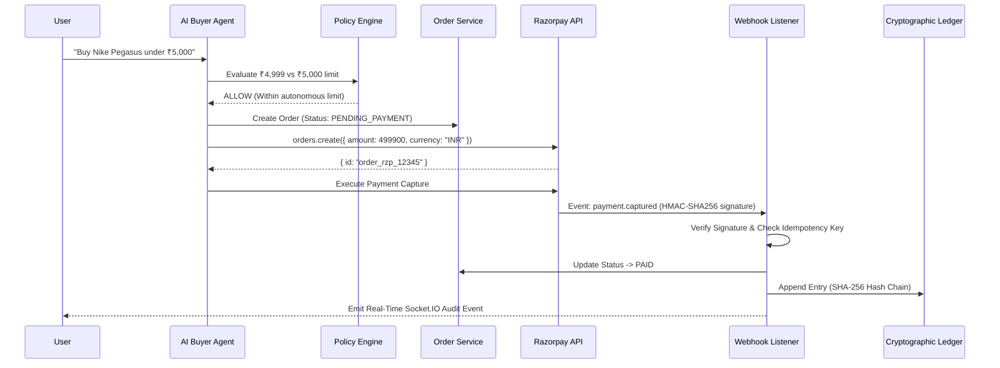

# Payment Architecture & Razorpay Flow



## Idempotency Guarantees
- Every webhook transaction registers an immutable `event_id` in `webhook_events`.
- Duplicate webhooks return `200 OK` with `processed_already: true` and execute 0 duplicate database mutations or ledger entries.

## Cryptographic Hash-Chain Ledger
Every payment capture creates an append-only entry linking `prev_hash` to `hash` calculated using SHA-256:
```json
{
  "id": 1,
  "idempotency_key": "pay_settle_order_1_pay_1",
  "type": "COMMERCE_SETTLEMENT",
  "from_entity": "buyer_agent_001",
  "to_entity": "mch_urbanfit_001",
  "amount_paise": 499900,
  "reference_id": "order_1",
  "prev_hash": "0000000000000000000000000000000000000000000000000000000000000000",
  "hash": "e3b0c44298fc1c149afbf4c8996fb92427ae41e4649b934ca495991b7852b855"
}
```
If any historical record is modified, `verifyChain()` detects the exact broken block.
